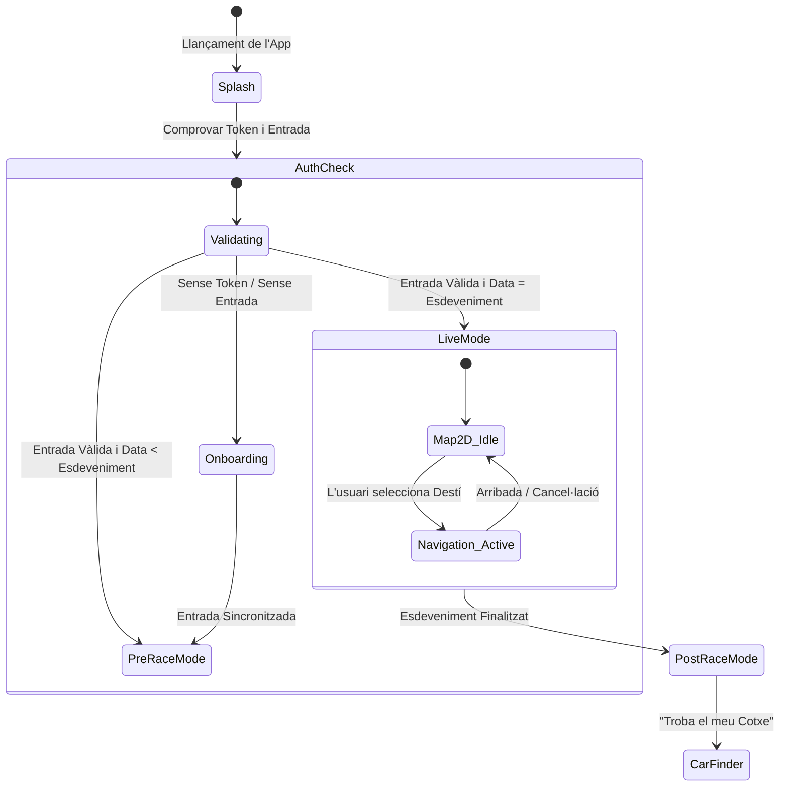
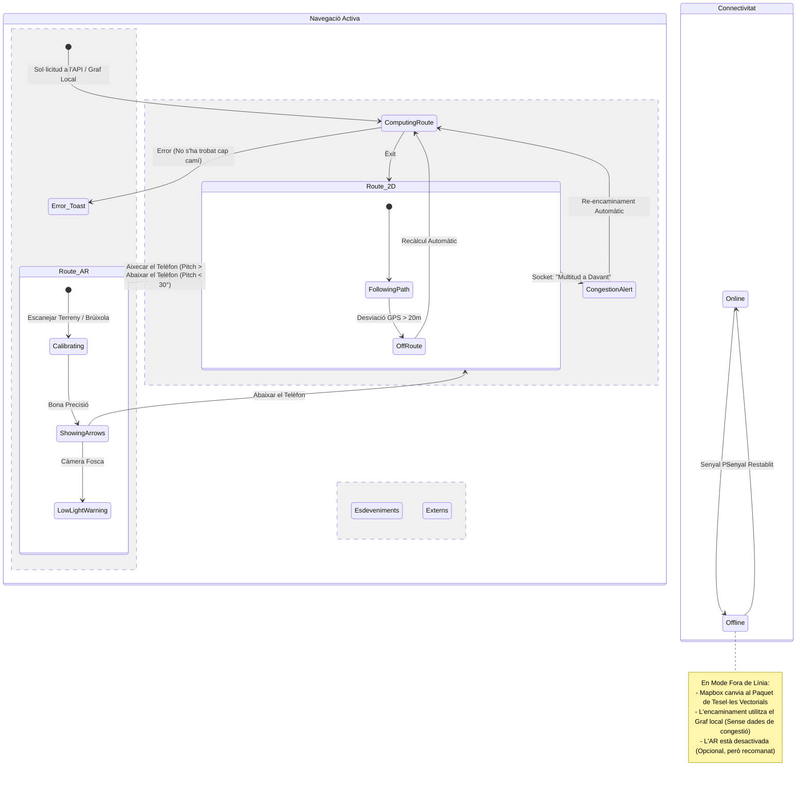

# Màquina d'Estats de l'App

## 1. Flux d'Alt Nivell (Estats Globals)

Aquest diagrama defineix el macro-cicle de vida de l'aplicació.

## 2. El Motor de Navegació (Lògica Complexa)

Aquí és on passa la màgia (i la complexitat). Definim com l'usuari entra i surt del mode AR i com gestionem la pèrdua de connexió.

### Lògica de Transició AR/2D

* **Activador Principal:** Giroscopi (Inclinació del telèfon).
* Si `pitch > 60°` (mòbil vertical) -> **Activa l'AR**.
* Si `pitch < 30°` (mòbil pla) -> **Torna al 2D**.

* **Activador Secundari:** Botó manual "Veure en AR".

## 3. Descripció dels Estats Clau

### A. `PreRaceMode` (US3)

* **Objectiu:** Planificació i expectació.
* **Restriccions:** No consumeix bateria buscant GPS d'alta precisió.
* **UI:** Mostra l'horari (`events_schedule`), punts d'accés recomanats i descàrregues de mapes fora de línia.
* **Sortida:** Canvia automàticament a `LiveMode` el dia de la cursa a les 06:00 AM.

### B. `Navigation_Active` (US4, US7, US8)

És l'estat més crític. Consumeix molta bateria i dades.

* **Sub-estat `ComputingRoute`:**

1. Consulta al servidor (API) per congestió.
2. Si el servidor falla/triga > 3s, calcula la ruta local (Pla B).

* **Sub-estat `Route_AR`:**
* **Calibratge:** En aixecar el telèfon, ViroReact necessita 1-2 segons per ancorar el terreny. S'ha de mostrar un carregador "Detectant terreny...".
* **Bloqueig de Seguretat:** Si l'usuari camina massa ràpid (>10km/h), l'AR es bloqueja i mostra "Per la teva seguretat, mira endavant".

### C. `Offline_Mode` (US33)

Aquest és un "Estat Superposat" (pot ocórrer en qualsevol moment).

* **Comportament:**
* L'API de ruta (`POST /navigation/route`) està bloquejada.
* El motor de ruta local (`Mapbox.DirectionsFactory`) està activat.
* Els marcadors d'"Amics" s'amaguen (ja que no es poden actualitzar).
* Es mostra un bàner groc: "Mode fora de línia - Rutes bàsiques actives".

## 4. Casos Límit (Edge Cases a programar)

1. **"L'usuari fantasma":**

* *Situació:* El GPS diu que l'usuari és a 500 km del circuit (error d'inici).
* *Acció:* El diagrama d'estats ha d'evitar entrar a `Navigation_Active`. Mostra un modal: "Sembla que no ets al circuit".

2. **"El bucle de congestió":**

* *Situació:* El servidor diu que la ruta A està plena. L'app calcula la ruta B. 10 segons després, la ruta B també s'omple.
* *Acció:* Defineix un `debounce` a l'estat de `ReRouting`. No tornis a calcular més d'una vegada per minut per evitar confondre l'usuari.

3. **"Bateria Crítica":**

* *Situació:* Bateria < 15%.
* *Acció:* Força la transició de `Route_AR` a `Route_2D` i desactiva el sensor del giroscopi per estalviar energia.
