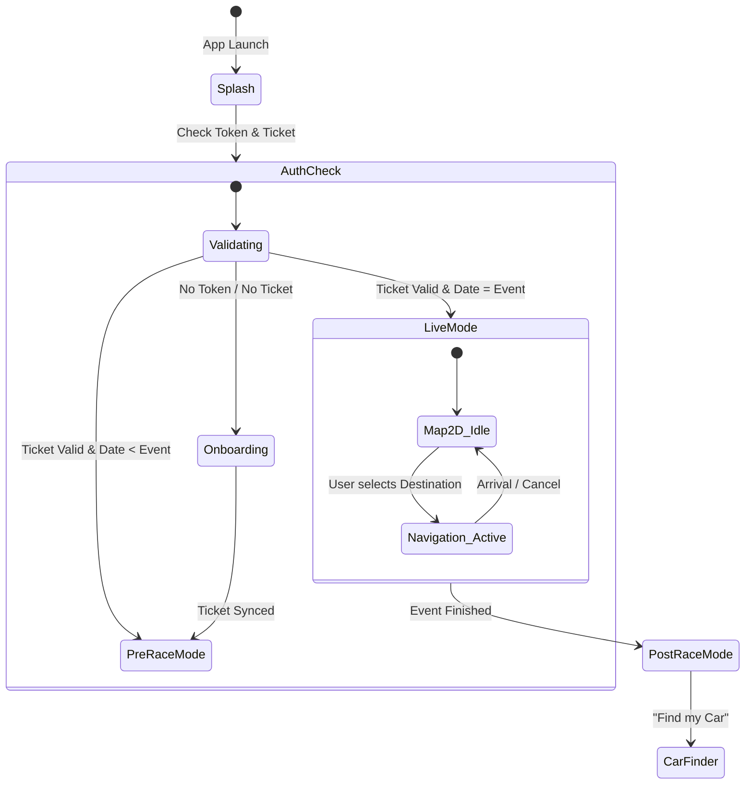
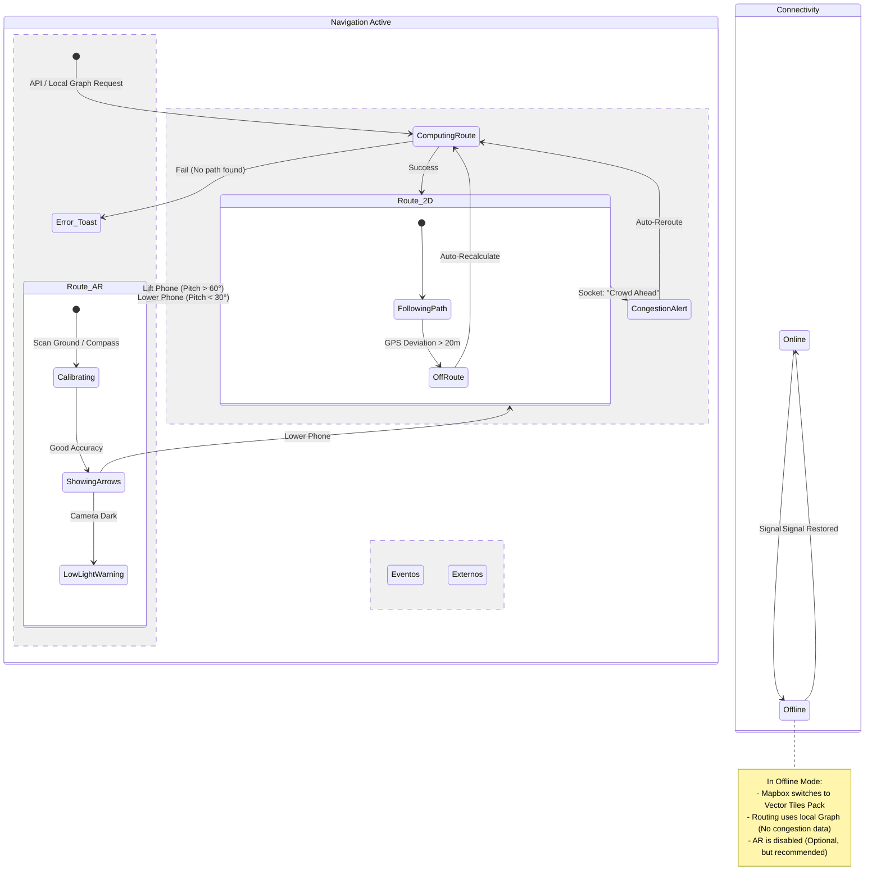

# App State Machine

## 1. High-Level Flow (Global States)

Este diagrama define el ciclo de vida macro de la aplicación.

## 2. The Navigation Engine (Complex Logic)

Aquí es donde ocurre la magia (y la complejidad). Definimos cómo entra y sale el usuario del modo AR y cómo gestionamos la pérdida de conexión.

### Lógica de Transición AR/2D

* **Trigger Principal:** Giroscopio (Phone Tilt).
* Si `pitch > 60°` (móvil vertical) -> **Activar AR**.
* Si `pitch < 30°` (móvil plano) -> **Volver a 2D**.

* **Trigger Secundario:** Botón manual "Ver en AR".

## 3. Descripción de Estados Clave

### A. `PreRaceMode` (US3)

* **Objetivo:** Planificación y hype.
* **Restricciones:** No gasta batería buscando GPS de alta precisión.
* **UI:** Muestra el horario (`events_schedule`), accesos recomendados y descarga de mapas offline.
* **Salida:** Se convierte en `LiveMode` automáticamente el día de la carrera a las 06:00 AM.

### B. `Navigation_Active` (US4, US7, US8)

Es el estado más crítico. Consume mucha batería y datos.

* **Sub-estado `ComputingRoute`:**

1. Consulta al servidor (API) por congestión.
2. Si servidor falla/tarda > 3s, calcula ruta local (Plan B).

* **Sub-estado `Route_AR`:**
* **Calibración:** Al levantar el móvil, ViroReact necesita 1-2 segundos para anclar el suelo. Debes mostrar un loader "Detectando suelo...".
* **Safety Lock:** Si el usuario camina muy rápido (>10km/h), la AR se bloquea y muestra "Por tu seguridad, mira al frente".

### C. `Offline_Mode` (US33)

Este es un "Estado Superpuesto" (puede ocurrir en cualquier momento).

* **Comportamiento:**
* La API de rutas (`POST /navigation/route`) se bloquea.
* Se activa el motor de rutas local (`Mapbox.DirectionsFactory`).
* Se ocultan los marcadores de "Amigos" (ya que no se pueden actualizar).
* Se muestra un banner amarillo: "Modo Sin Conexión - Rutas básicas activas".

## 4. Edge Cases (Casos Límite a programar)

1. **"El usuario fantasma":**

* *Situación:* El GPS dice que el usuario está a 500km del circuito (error de inicio).
* *Acción:* El diagrama de estados debe impedir entrar en `Navigation_Active`. Mostrar modal: "Parece que no estás en el circuito".

2. **"El bucle de congestión":**

* *Situación:* El servidor dice que la ruta A está llena. La app calcula la ruta B. A los 10 segundos, la ruta B también se llena.
* *Acción:* Definir un `debounce` en el estado `ReRouting`. No recalcular más de 1 vez por minuto para no marear al usuario.

3. **"Batería Crítica":**

* *Situación:* Batería < 15%.
* *Acción:* Forzar transición de `Route_AR` a `Route_2D` y deshabilitar el sensor de giroscopio para ahorrar energía.
