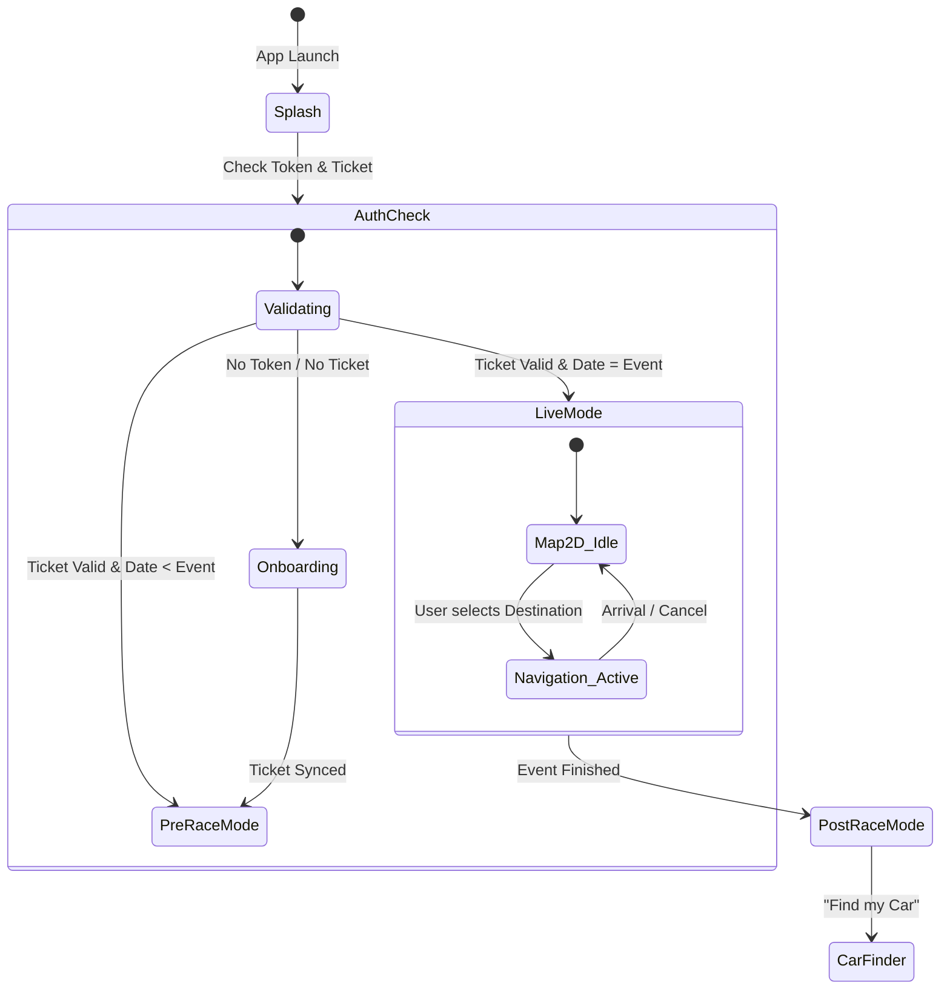

# App State Machine

## 1. High-Level Flow (Global States)

This diagram defines the macro lifecycle of the application.

## 2. The Navigation Engine (Complex Logic)

This is where the magic (and complexity) happens. We define how the user enters and exits AR mode and how we handle connection loss.

### AR/2D Transition Logic

* **Main Trigger:** Gyroscope (Phone Tilt).
* If `pitch > 60°` (mobile vertical) -> **Activate AR**.
* If `pitch < 30°` (mobile flat) -> **Return to 2D**.

* **Secondary Trigger:** Manual "View in AR" button.

## 3. Key States Description

### A. `PreRaceMode` (US3)

* **Objective:** Planning and hype.
* **Restrictions:** Does not consume battery searching for high-precision GPS.
* **UI:** Shows the schedule (`events_schedule`), recommended access points, and offline map downloads.
* **Exit:** Automatically switches to `LiveMode` on race day at 06:00 AM.

### B. `Navigation_Active` (US4, US7, US8)

It is the most critical state. Consumes a lot of battery and data.

* **Sub-state `ComputingRoute`:**

1. Query the server (API) for congestion.
2. If server fails/takes > 3s, calculate local route (Plan B).

* **Sub-state `Route_AR`:**
* **Calibration:** When lifting the phone, ViroReact needs 1-2 seconds to anchor the ground. You must show a loader "Detecting ground...".
* **Safety Lock:** If the user walks too fast (>10km/h), the AR is blocked and shows "For your safety, look ahead".

### C. `Offline_Mode` (US33)

This is an "Overlaid State" (can occur at any time).

* **Behavior:**
* The route API (`POST /navigation/route`) is blocked.
* The local route engine (`Mapbox.DirectionsFactory`) is activated.
* "Friends" markers are hidden (since they cannot be updated).
* A yellow banner is shown: "Offline Mode - Basic routes active".

## 4. Edge Cases (Boundary cases to program)

1. **"The ghost user":**

* *Situation:* The GPS says the user is 500km from the circuit (start error).
* *Action:* The state diagram must prevent entering `Navigation_Active`. Show modal: "It seems you are not at the circuit".

2. **"The congestion loop":**

* *Situation:* The server says route A is full. The app calculates route B. 10 seconds later, route B also becomes full.
* *Action:* Define a `debounce` in the `ReRouting` state. Do not recalculate more than once per minute to avoid confusing the user.

3. **"Critical Battery":**

* *Situation:* Battery < 15%.
* *Action:* Force transition from `Route_AR` to `Route_2D` and disable the gyroscope sensor to save energy.
