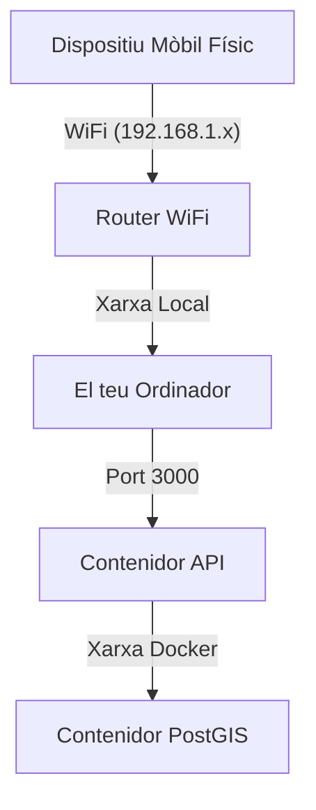

# Circuit Copilot: Guia de Configuració per a Desenvolupadors

Aquesta guia descriu la configuració de l'entorn de desenvolupament local per al monorepo de **Circuit Copilot**.

## Prerequisits

Abans de clonar el repositori, assegura't de tenir instal·lat el següent:

1. **Node.js (LTS)**: v18.0.0 o superior.
2. **Docker Desktop**: En funcionament i actualitzat (necessari per a PostGIS i Redis).
3. **Git**: Per al control de versions.
4. **Entorn de Desenvolupament Mòbil**:

- **iOS**: Xcode (només per a Mac).
- **Android**: Android Studio + SDK Platform Tools.

5. **Compte de Mapbox**: Necessites un token d'accés públic.

## Estructura del Repositori (Monorepo)

Utilitzem **Turborepo** / Workspaces. No cal fer `npm install` a cada carpeta.

```text
/
├── apps/
│   ├── mobile/         # Aplicació Expo (React Native)
│   └── api/           # API Node.js + Express
├── packages/
│   ├── shared/         # Tipus TypeScript compartits (@app/shared)
│   └── database/       # Esquema de Prisma/Sequelize i Migracions
└── docker-compose.yml  # Orquestra la base de dades i Redis
```

## Pas 1: Instal·lació

1. **Clona el repositori:**

```bash
git clone https://github.com/la-teva-org/circuit-copilot.git
cd circuit-copilot
```

2. **Instal·la les dependències (Arrel):**
   Aquest projecte utilitza **npm** com a gestor de paquets estàndard.

```bash
npm install
```

## Pas 2: Variables d'Entorn

...

## Pas 3: Base de dades i Infraestructura

Utilitzem Docker Compose per executar PostgreSQL (amb l'extensió PostGIS).

1. **Inicia l'entorn amb Docker:**
   Aquesta ordre aixecarà la base de dades i l'API.

```bash
docker compose up --build
```

## Pas 4: Desenvolupament amb Turbo

Per al desenvolupament actiu, utilitzem **Turbo** per orquestrar totes les aplicacions simultàniament:

```bash
npm run dev
```

Això carregarà tant l'`api` com la part `mobile` en una sola sessió de terminal.

### Comandos de Turbo

- `npm run dev`: Mode desenvolupament amb recàrrega en calent.
- `npm run build`: Compila totes les aplicacions verificant tipus.
- `npm run lint`: Executa l'eslint a tot el monorepo.

### El mapa de Mapbox està en blanc

- **Causa:** Token invàlid o error de correspondència de l'ID del paquet (Bundle ID).
- **Solució:** Assegura't que el teu Token de Mapbox tingui l'àmbit `Downloads:Read` i que el teu `bundleIdentifier` a `app.json` coincideixi amb el que has registrat a Mapbox.

### Error de PostGIS: "function st_dwithin does not exist"

- **Causa:** L'extensió PostGIS no s'ha activat.
- **Solució:** Connecta't a la base de dades i executa: `CREATE EXTENSION IF NOT EXISTS postgis;` (O comprova si les migracions s'han executat correctament).

### Diagrama de Topologia de Xarxa

Com que connectar un dispositiu mòbil físic a un backend local de Docker és el punt de fallada més comú, visulitzar el flux de xarxa és d'ajuda:


